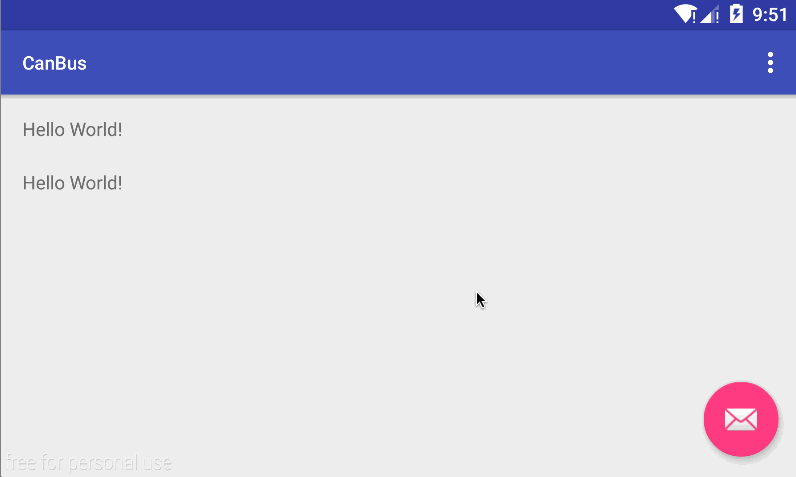

[](http://www.android-gems.com/lib/canyinghao/CanBus)

# CanBus
通过反射发送通知事件，传递数据

  

##添加依赖
```JAVA
compile 'com.canyinghao:canbus:1.0.0'
```

## 使用方式 
**1.发送通知，传递参数**  
接收通知，需要先注册，在不需要使用时注销，然后在onCanBus方法中处理事件及参数。发送的参数类型需与接受的类型保持一致。在线程中发送通知，接收也会在主线程中处理。onCanBus方法始终在主线程中，需注意。
```JAVA
public class MainActivity extends AppCompatActivity {

    int num;

    @Override
    protected void onCreate(Bundle savedInstanceState) {
        super.onCreate(savedInstanceState);
        setContentView(R.layout.activity_main);
        Toolbar toolbar = (Toolbar) findViewById(R.id.toolbar);
        setSupportActionBar(toolbar);

        FloatingActionButton fab = (FloatingActionButton) findViewById(R.id.fab);
        fab.setOnClickListener(new View.OnClickListener() {
            @Override
            public void onClick(View view) {
                num++;
                CanBus.getDefault().post("canbus post num " + num);
                Snackbar.make(view, "CanBus.getDefault().post(canbus post num " + num + ")", Snackbar.LENGTH_SHORT)
                        .setAction("Action", null).show();
            }
        });

        CanBus.getDefault().register(this);


    }


    public void onCanBus(String str){

        ((TextView)findViewById(R.id.tv_1)).setText(str);
        ((TextView)findViewById(R.id.tv_2)).setText(str);

    }


    @Override
    public boolean onCreateOptionsMenu(Menu menu) {
        // Inflate the menu; this adds items to the action bar if it is present.
        getMenuInflater().inflate(R.menu.menu_main, menu);
        return true;
    }

    @Override
    public boolean onOptionsItemSelected(MenuItem item) {
        // Handle action bar item clicks here. The action bar will
        // automatically handle clicks on the Home/Up button, so long
        // as you specify a parent activity in AndroidManifest.xml.
        int id = item.getItemId();

        //noinspection SimplifiableIfStatement
        if (id == R.id.action_settings) {
            return true;
        }

        return super.onOptionsItemSelected(item);
    }

    @Override
    protected void onDestroy() {
        super.onDestroy();
        CanBus.getDefault().unregister(this);
    }
}

``` 


### 开发者

 

canyinghao: <canyinghao@hotmail.com>  


### License

    Copyright 2016 canyinghao

    Licensed under the Apache License, Version 2.0 (the "License");
    you may not use this file except in compliance with the License.
    You may obtain a copy of the License at

       http://www.apache.org/licenses/LICENSE-2.0

    Unless required by applicable law or agreed to in writing, software
    distributed under the License is distributed on an "AS IS" BASIS,
    WITHOUT WARRANTIES OR CONDITIONS OF ANY KIND, either express or implied.
    See the License for the specific language governing permissions and
    limitations under the License.

